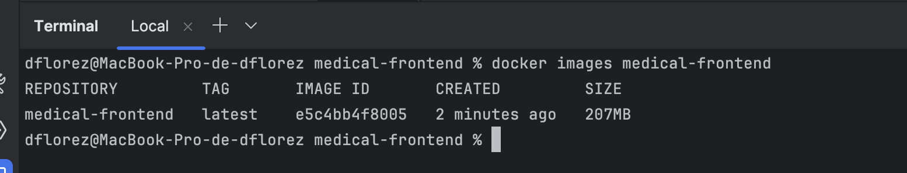
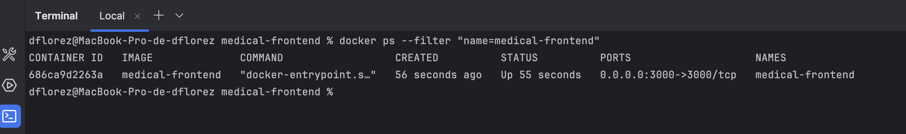
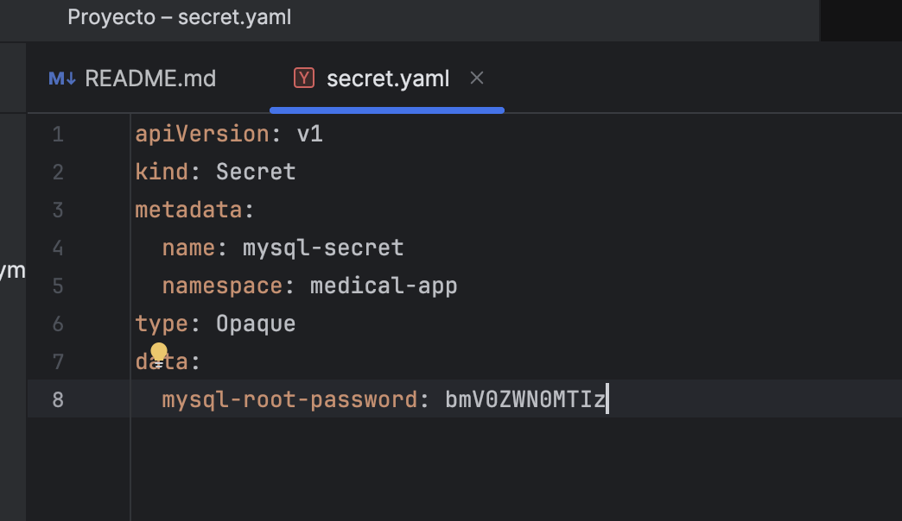
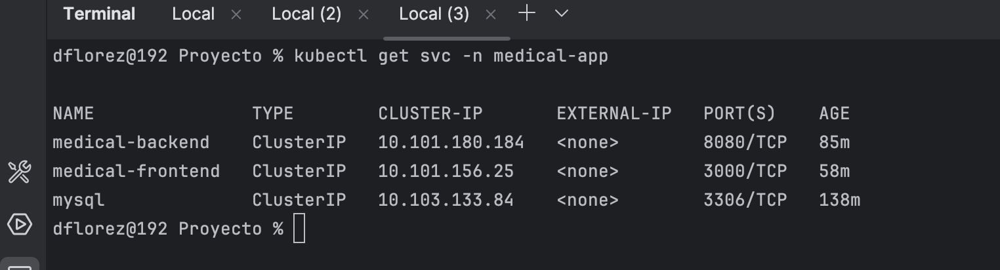
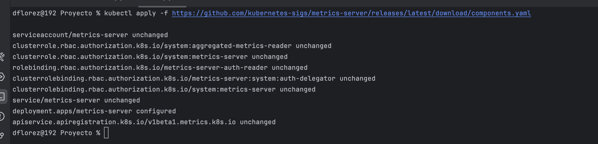

# Solucion Proyecto Curso 


# Pre requisito

1. Tener instalado Java 17
2. Tener instalado Node.js LTS
3. Tener instalado Docker
4. Tener instalado NPM
5. Tener Creada una base de datos en MySqql con el esquema de  base de datos db-medical
# Paso 1  Dockerizar  backend ms-medical

1.1 Ingresa el poryecto base del backend en la carpeta `ms-medical` y ejecuta el siguiente comando en la terminal:

```bash
cd /Users/dflorez/Downloads/Proyecto/BE/ms-medical
```

1.2 Para crear el artefacto del back ejecutar el siguiente comando en la terminal:

```bash
./gradlew clean build -x test
```


1.3 Crear el Archivo Dockerfile en la raiz del proyecto con el siguiente contenido:

```dockerfile
# Imagen base recomendada para Java 17 en producción/K8s
FROM eclipse-temurin:17-jdk

# Crea el directorio de trabajo
WORKDIR /app

# Copia el artefacto jar generado por Gradle
COPY build/libs/ms-medical-0.0.1-SNAPSHOT.jar app.jar

# Expone el puerto del backend
EXPOSE 8080

# Comando de inicio
ENTRYPOINT ["java", "-jar", "app.jar"]
```


1.4 Crear imagen basado en dockerFile se ejecuta el siguiente comando
```bash
 docker build -t ms-medical-backend .
```


1.5 Verificar que la imagen se haya creado correctamente con el siguiente comando:
```bash
 docker images ms-medical-backend
```

1.6 Ejecutar el contenedor de la imagen creada con el siguiente comando:
```bash
 docker run -d -p 8080:8080 --name ms-medical-backend ms-medical-backend
```

1.7 Verificar que el contenedor se esté ejecutando correctamente con el siguiente comando:
```bash
docker ps --filter "name=ms-medical-backend"
```

1.8 Probar el endpoint del backend para verificar que esté funcionando correctamente ingresamos al siguiente enlace en el navegador:
```bash
http://localhost:8080/swagger-ui/index.html# 
```

1.9 En e proyecto de FE se creara un archivo llamado .dockerignore con el siguiente contenido:
```dockerignore
node_modules
build
dist
.git
.idea
```

1.10 Crear el archivo dockerFiles en la raiz del proyecto con el siguiente contenido:
```dockerfile
# 1) Build
FROM node:18-alpine AS builder
WORKDIR /app
COPY package*.json ./
RUN npm ci
COPY . .
RUN npm run build         # CRA -> genera build/ ; Vite -> dist/

# 2) Runtime sin Nginx
FROM node:18-alpine
WORKDIR /app
RUN npm i -g serve        # servidor estático simple
# Copia el artefacto del build (si usas Vite, cambia build -> dist)
COPY --from=builder /app/build /app/build
EXPOSE 3000
CMD ["serve", "-s", "build", "-l", "3000"]
```

1.11 NOs ubicamos en la carpeta raiz del proyecto con el siguiente comando:
```bash
cd /Users/dflorez/Downloads/Proyecto/FE/medical-frontend
```

1.12 Crear imagen basado en dockerFile se ejecuta el siguiente comando
```bash
docker build -t medical-frontend .
```

1.13 Verificar que la imagen se haya creado correctamente con el siguiente comando:
```bash
 docker images medical-frontend
```

1.14 Ejecutar el contenedor de la imagen creada con el siguiente comando:
```bash
 docker run -d -p 3000:3000 --name medical-frontend medical-frontend
```

1.15 Verificar que el contenedor se esté ejecutando correctamente con el siguiente comando:
```bash
docker ps --filter "name=medical-frontend"
```

1.16 Probar el endpoint del frontend para verificar que esté funcionando correctamente ingresamos al siguiente enlace en el navegador:
```bash
http://localhost:3000/
```

#Paso 2 Habilitar Kubernetes en Docker Desktop

1. Abrir Docker Desktop y dirigirse a la sección de "Settings" (Configuración).
   
2. En la pestaña "Kubernetes", activar la opción "Enable Kubernetes" (Habilitar Kubernetes).
   
3. Hacer clic en "Apply & Restart" (Aplicar y Reiniciar) para aplicar los cambios y reiniciar Docker Desktop.
   
4. Una vez que Docker Desktop se haya reiniciado, verificar que Kubernetes esté funcionando correctamente. Debería aparecer un mensaje indicando que Kubernetes está activo.
   
5. Para verificar que Kubernetes está funcionando correctamente, abrir una terminal y ejecutar el siguiente comando:
```bash
kubectl cluster-info
```
Debería mostrar información sobre el clúster de Kubernetes, incluyendo la dirección del servidor de la API y otros detalles.


# Paso 3 Configurar k8s
1. Crear la carpeta `k8s` en la raiz del proyecto y dentro de esta crear los siguientes archivos:

2. Se creara name file namespace namespace.yaml en la carpeta k8s con el siguiente contenido:
```yaml
apiVersion: v1
kind: Namespace
metadata:
  name: medical-app
```


3. Crear el namespace ejecutando el siguiente comando en la terminal:

```bash
kubectl apply -f k8s/namespace.yaml
```

4. Verificar que el namespace se haya creado correctamente:

```bash
kubectl get namespace medical-app
```


5. La contraseña debe estar codificada en base64. Puedes usar el siguiente comando para codificar la contraseña:
```bash
echo -n 'netect123' | base64
```

5. Se Creara el Secret lo cual permite almacenar de forma segura las credenciales de la base de datos. Crear el archivo `secret.yaml` con el siguiente contenido:

```yaml
apiVersion: v1
kind: Secret
metadata:
  name: mysql-secret
  namespace: medical-app
type: Opaque
data:
  mysql-root-password: bmV0ZWN0MTIz
```

6. Crear el Secret ejecutando el siguiente comando en la terminal:

```bash
kubectl apply -f k8s/secret.yaml
```

7. Verificar que el Secret se haya creado correctamente:

```bash
kubectl get secret mysql-secret -n medical-app
```


# Paso 5 Creacion de la base de datos MySQL en Kubernetes

1. Crear el archivo 'mysql-volume.yaml' para garantiza que tu base de datos no pierda datos si el contenedor se reinicia.

```yaml
apiVersion: v1
kind: PersistentVolumeClaim
metadata:
  name: mysql-pvc
  namespace: medical-app
spec:
  accessModes:
    - ReadWriteOnce
  resources:
    requests:
      storage: 1Gi
```


2. Se crea el archivo 'mysql-deployment.yaml' para crear el despliegue de MySQL en Kubernetes:

```yaml
apiVersion: apps/v1
kind: Deployment
metadata:
  name: mysql-medical
  namespace: medical-app
  labels:
    app: mysql-medical
spec:
  replicas: 1
  selector:
    matchLabels:
      app: mysql-medical
  template:
    metadata:
      labels:
        app: mysql-medical
    spec:
      containers:
        - name: mysql-medical
          image: mysql:5.7
          imagePullPolicy: IfNotPresent
          env:
            - name: MYSQL_ROOT_PASSWORD
              valueFrom:
                secretKeyRef:
                  name: mysql-secret
                  key: mysql-root-password
          ports:
            - containerPort: 3306
          volumeMounts:
            - name: mysql-storage
              mountPath: /var/lib/mysql
      volumes:
        - name: mysql-storage
          persistentVolumeClaim:
            claimName: mysql-pvc
```


3. Crear el Service para exponer el servicio de MySQL en Kubernetes. Crear el archivo `mysql-service.yaml` con el siguiente contenido:

```yaml
apiVersion: v1
kind: Service
metadata:
  name: mysql
  namespace: medical-app
spec:
  selector:
    app: mysql
  ports:
    - protocol: TCP
      port: 3306
      targetPort: 3306
  type: ClusterIP
```


4. Crear el volumen persistente ejecutando el siguiente comando en la terminal:

```bash
kubectl apply -f k8s/mysql-volume.yaml
```


5. Crear el Deployment de MySQL ejecutando el siguiente comando en la terminal:

```bash
kubectl apply -f k8s/mysql-deployment.yaml
```


6. Crear el Service de MySQL ejecutando el siguiente comando en la terminal:

```bash
kubectl apply -f k8s/mysql-service.yaml
```


7. Verificar que el Deployment de MySQL se haya creado correctamente:

```bash
kubectl get deployments -n medical-app
```


8. validar que el service de MySQL se haya creado correctamente:

```bash
kubectl get services -n medical-app
```

9. Crear una conexión al contenedor de MySQL para crear la base de datos `db-medical` ejecutando el siguiente comando en la terminal:

```bash
kubectl port-forward svc/mysql 3306:3306 -n medical-app
```

10. Se realiza la conexion a MySQL por medio de DBeaver y creamos la base de datos `db-medical`:


# Paso 4 Despliegue del backend en Kubernetes
1. Ajustar el aplication.yml del backend para que se conecte a la base de datos MySQL en Kubernetes. Cambiar la URL de conexión a la base de datos en el archivo `application.yaml`:

```yaml
url: jdbc:mysql://mysql:3306/db-medical?useSSL=false&serverTimezone=UTC
```

2. re crear la imagen de back con el ajuste de la base de datos , seguir paso  1 hasta la creacion de la imagen del backend:

```bash
 cd /Users/dflorez/Downloads/Proyecto/BE/ms-medical
 ./gradlew clean build -x test
docker build -t ms-medical-backend .
```

3. Crear el archivo `backend-deployment.yaml` para crear el despliegue del backend en Kubernetes:

```yaml
apiVersion: apps/v1
kind: Deployment
metadata:
   name: contact-backend
   namespace: medical-app
spec:
   replicas: 1
   selector:
      matchLabels:
         app: medical-backend
   template:
      metadata:
         labels:
            app: medical-backend
      spec:
         containers:
            - name: medical-backend
              image: ms-medical-backend:latest
              imagePullPolicy: Never
              ports:
                 - containerPort: 8080
              env:
                 - name: MYSQL_PASSWORD
                   valueFrom:
                      secretKeyRef:
                         name: mysql-secret
                         key: mysql-root-password
```

4. Crear el archivo `backend-service.yaml` para exponer el servicio del backend en Kubernetes:

```yaml
apiVersion: v1
kind: Service
metadata:
  name: medical-backend
  namespace: medical-app
spec:
  selector:
    app: medical-backend
  ports:
    - port: 8080
      targetPort: 8080
  type: ClusterIP
```


5.Crear el Service del backend ejecutando el siguiente comando en la terminal:

```bash
kubectl apply -f k8s/backend-service.yaml
```

6.Crear el Deployment del backend ejecutando el siguiente comando en la terminal:
```bash
kubectl apply -f k8s/backend-deployment.yaml
```

7. Verificar que el Deployment del backend se haya creado correctamente:

```bash
kubectl get deployments -n medical-app
```

8. Verificar que el deployment del pod del backend se haya creado correctamente:

```bash
kubectl get pods -n medical-app
```


9. ver logs del pod del backend para verificar que se esté ejecutando correctamente:

```bash
kubectl logs -f <nombre-del-pod> -n medical-app
```

10. forward el puerto del backend para poder acceder a la aplicación:

```bash
kubectl port-forward svc/medical-backend 8080:8080 -n medical-app
```

11. Probar el endpoint del backend para verificar que esté funcionando correctamente ingresamos al siguiente enlace en el navegador:

```bash
http://localhost:8080/swagger-ui/index.html# 
```


# Paso 5 Despliegue del frontend en Kubernetes
1. Crear el archivo `frontend-deployment.yaml` para crear el despliegue del frontend en Kubernetes:

```yaml
apiVersion: apps/v1
kind: Deployment
metadata:
  name: medical-frontend
  namespace: medical-app
  labels:
    app: medical-frontend
spec:
  replicas: 1
  selector:
    matchLabels:
      app: medical-frontend
  template:
    metadata:
      labels:
        app: medical-frontend
    spec:
      containers:
        - name: medical-frontend
          image: medical-frontend:latest
          imagePullPolicy: Never
          ports:
            - containerPort: 3000
          env:
            - name: NODE_ENV
              value: "production"
```


2. Crear el archivo `frontend-service.yaml` para exponer el servicio del frontend en Kubernetes:

```yaml
apiVersion: v1
kind: Service
metadata:
  name: medical-frontend
  namespace: medical-app
spec:
  selector:
    app: medical-frontend
  ports:
    - port: 3000
      targetPort: 3000
  type: ClusterIP
```


3. Crear el Service del frontend ejecutando el siguiente comando en la terminal:

```bash
kubectl apply -f k8s/frontend-service.yaml
```

4. Crear el Deployment del frontend ejecutando el siguiente comando en la terminal:
```bash
kubectl apply -f k8s/frontend-deployment.yaml
```


5. Verificar que el Deployment del frontend se haya creado correctamente:
```bash
kubectl get deployments -n medical-app
```

6. Verificar que el deployment del pod del frontend se haya creado correctamente:

```bash
kubectl get pods -n medical-app
```


7. exponer el forward del backend para poder acceder a la aplicación y ser consumido por el frontend:

```bash
kubectl port-forward svc/medical-backend 8080:8080 -n medical-app
```
8. crear forward el puerto del frontend para poder acceder a la aplicación:

```bash
kubectl port-forward svc/medical-frontend 3000:3000 -n medical-app
```


# Paso 6 Etiquetar Nodos y nodes Affinity

Para controlar en qué nodo corre cada componente (útil cuando haya más de un nodo), con esto se evita mezclar los ambientes y nodos


1. Para listar los nodos disponibles en tu clúster de Kubernetes, ejecuta el siguiente comando:

```bash
kubectl get nodes
```


Para este caso docker desktop solo tiene un nodo llamado docker-desktop y es necesario etiquetarlo para que los pods del backend y frontend se ejecuten en este nodo.

2. Para etiquetar el nodo `docker-desktop` usaremos el siguiente comando:

```bash
kubectl label nodes docker-desktop tier-backend=true
kubectl label nodes docker-desktop tier-frontend=true
kubectl label nodes docker-desktop tier-db=true
kubectl get nodes
```

3. para ver las etiquetas de los nodos puedes usar el siguiente comando:

```bash
kubectl get nodes --show-labels
```


4.  PAra ajustar el affinity en back es necesario modificar el archivo `backend-deployment.yaml` para que los pods del backend se ejecuten en el nodo con la etiqueta `tier-backend=true`. Agrega la siguiente sección al archivo:

```yaml
apiVersion: apps/v1
kind: Deployment
metadata:
   name: contact-backend
   namespace: medical-app
   labels:
      app: medical-backend
spec:
   replicas: 1
   selector:
      matchLabels:
         app: medical-backend
   template:
      metadata:
         labels:
            app: medical-backend
      spec:
         affinity:
            nodeAffinity:
               requiredDuringSchedulingIgnoredDuringExecution:
                  nodeSelectorTerms:
                     - matchExpressions:
                          - key: tier-backend
                            operator: In
                            values: ["true"]
            podAntiAffinity:
               preferredDuringSchedulingIgnoredDuringExecution:
                  - weight: 50
                    podAffinityTerm:
                       labelSelector:
                          matchExpressions:
                             - key: app
                               operator: In
                               values: ["medical-backend"]
                       topologyKey: "kubernetes.io/hostname"
         containers:
            - name: medical-backend
              image: ms-medical-backend:latest
              imagePullPolicy: Never
              ports:
                 - containerPort: 8080
              env:
                 - name: MYSQL_PASSWORD
                   valueFrom:
                      secretKeyRef:
                         name: mysql-secret
                         key: mysql-root-password
               # Probes TCP porque tu app no expone /actuator/health
              readinessProbe:
                 tcpSocket:
                    port: 8080
                 initialDelaySeconds: 20
                 periodSeconds: 10
                 timeoutSeconds: 3
                 failureThreshold: 10
              livenessProbe:
                 tcpSocket:
                    port: 8080
                 initialDelaySeconds: 40
                 periodSeconds: 20
                 timeoutSeconds: 3
                 failureThreshold: 10
              resources:
                 requests:
                    cpu: "100m"
                    memory: "256Mi"
                 limits:
                    cpu: "500m"
                    memory: "512Mi"
```

5. para apliar los cambios en el deployment del backend, ejecuta el siguiente comando:

```bash
kubectl apply -f k8s/backend-deployment.yaml
```


6. para observar los cambios en el deployment del backend, ejecuta el siguiente comando:

```bash
kubectl get pods -n medical-app -o wide
```


Node Affinity permite controlar en qué nodo del clúster se ejecutan los pods, aplicando reglas basadas en etiquetas de los nodos.
Esto es útil para:

Separar backend, frontend y base de datos en distintos nodos (aislamiento de cargas).

Garantizar que los pods tengan los recursos adecuados.

Evitar que Kubernetes ejecute un pod en un nodo no deseado.

En nuestro caso, queremos que el backend solo se ejecute en nodos con la etiqueta tier-backend=true.


# Paso 7 Monitoreo y tips

Es importante monitorear el estado de los pods y servicios en Kubernetes para asegurarse de que todo esté funcionando correctamente. Esto nos permite detectar problemas a tiempo y tomar acciones correctivas.   

* Per estado de pods y despliegues (Running/Ready/Restarts).

* Revisar eventos y logs cuando algo falla.

* Vigilar recursos (CPU/Mem) para prevenir cuellos de botella.

1. Listar pods con nodo y IP:
```bash
kubectl get pods -n medical-app -o wide
```
2. Ver despliegues con  número de réplicas y estado con el siguiente comando:

```bash
kubectl get deployments -n medical-app
```

3. Ver servicios y sus IPs con el siguiente comando:

```bash
kubectl get svc -n medical-app
```


# 8 Monitoreo de recursos (CPU/Mem)

1. Instalar Metrics Server para monitorear recursos:

```bash
kubectl apply -f https://github.com/kubernetes-sigs/metrics-server/releases/latest/download/components.yaml
```


2. Ver el estado de los recursos de los pods:

```bash
kubectl top nodes
```

3. Con este comando consultamos el consumo actual de CPU y memoria de cada pod en el namespace medical-app:

```bash
kubectl top pods -n medical-app
```
